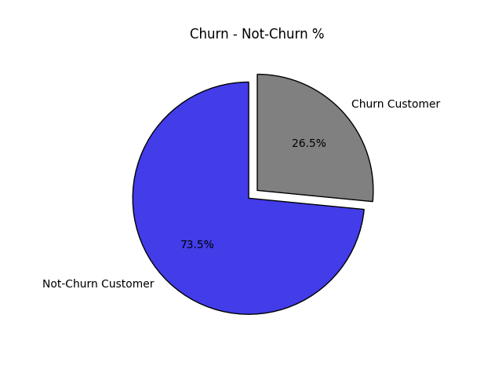
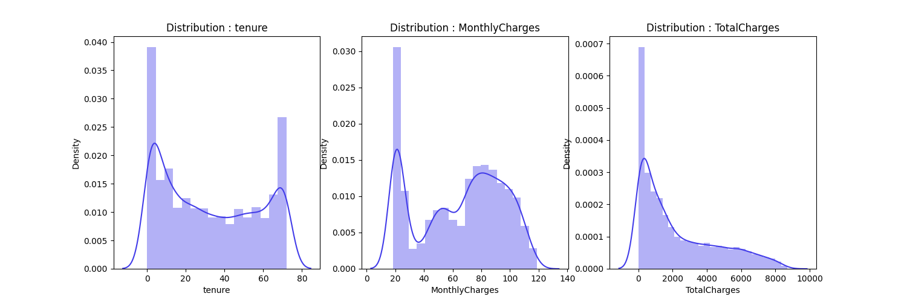
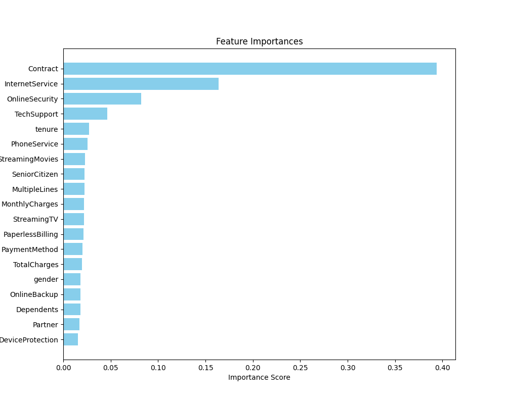
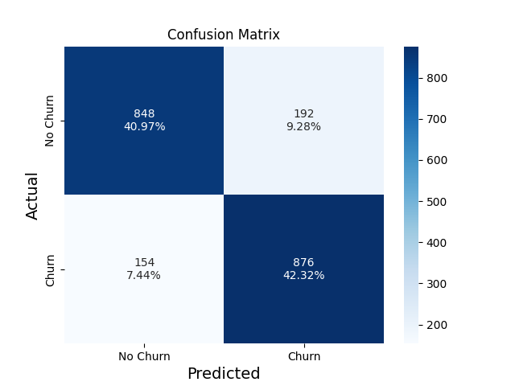

# Telco Customer Churn Analysis Project (0.83 F1 score)

[View the Tableau Dashboard](https://public.tableau.com/app/profile/finn.kliewer/viz/TelcoChurnAnalysis_17420779908330/Dashboard1?publish=yes)  

---

## Dataset Details

- **Source:** [Telco Customer Churn (Kaggle)](https://www.kaggle.com/blastchar/telco-customer-churn)
- **Description:** This dataset contains customer information, including demographics, account information, and subscribed services. The target variable is whether the customer churned.

---

## Exploratory Data Analysis (EDA)



26.5% of customers churned



Tenure and MonthlyCharges create a bimodal distribution with peaks at 0 - 70 and 20 - 80, respectively, while TotalCharges displays a right skewed distribution.



Feature importances


---

## Model Stacking

The project uses a stacking ensemble to improve predictive performance by combining multiple classifiers. The ensemble consists of:

- **Base Estimators:**
  - **XGBoost Classifier (`classifier_xgb`)**
  - **LightGBM Classifier (`classifier_lgbm`)**
  - **Random Forest Classifier (`classifier_rf`)**
  - **Decision Tree Classifier (`classifier_dt`)**

- **Final Estimator:**
  - **LightGBM Classifier (`classifier_lgbm`)**

The stacking is implemented as follows:

```python
from sklearn.ensemble import StackingClassifier

stack = StackingClassifier(
    estimators=[
        ('classifier_xgb', classifier_xgb),
        ('classifier_lgbm', classifier_lgbm),
        ('classifier_rf', classifier_rf),
        ('classifier_dt', classifier_dt)
    ],
    final_estimator=classifier_lgbm
)
```
---

## Model Evaluation

The model evaluated to an F1 score of 0.83 with an 85% accuracy in predicting customer churn.


```
              precision    recall  f1-score   support

           0       0.85      0.82      0.83      1040
           1       0.82      0.85      0.84      1030

    accuracy                           0.83      2070
   macro avg       0.83      0.83      0.83      2070
weighted avg       0.83      0.83      0.83      2070
```


